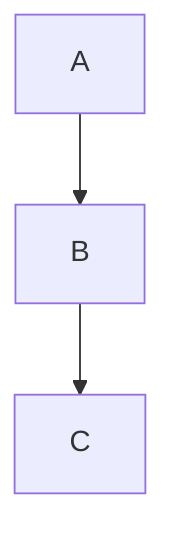

We have some ways to write code and the difference is the way how the application run the code look this diagram:

**Sync:**
in Sync the application just execute the next step when the previous step have finished and
will follow this process until the end of application.
Most of the programming languages are Sync by default like Python, C#, Java, and PHP and more.

**Async:**
In Async the application is different you can execute another task in another plan and other task will run
but this is only using one thread, this can be similar a one-person doing multiples task at the same time.
The most popular programming language's have Async too like I say below Javascript, Python, C#, Java, PHP, C++.

**Parallel:**
In PHP have multiples thread for do multiple actions at the same time, but it's not perfect like looks like
have a problem with Using multiple threads helps you get more out of a single processor. But then these 
threads need to sync their work in a shared memory. This can be difficult to get right.
Language's that are C, C++, Java, GO, Rust and more.
~~~~mermaid
sequenceDiagram
    participant Thread 1
    participant Thread 2
~~~~