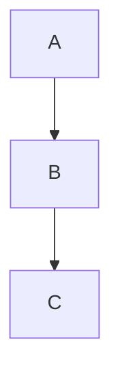

We have some ways to write code and the difference is the way how the application run the code look this diagram:

**Sync:**
in Sync the application just execute the next step when the previous step have finished and
will follow this process until the end of application.

**Async:**
In Async the application is different you can execute another task in another plan and other task will run
but this is only using one thread, this can be similar a one-person doing multiples task at the same time.

**Parallel:**
~~~~mermaid
sequenceDiagram
    participant Thread 1
    participant Thread 2
~~~~